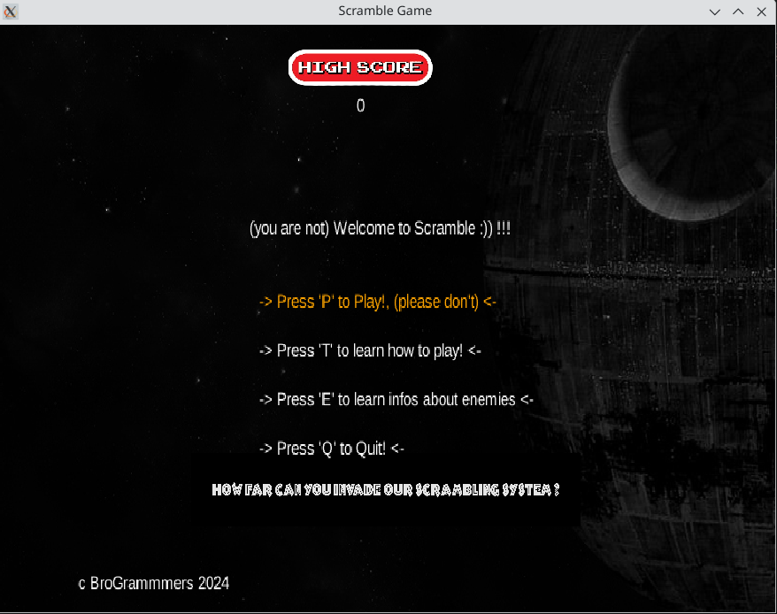
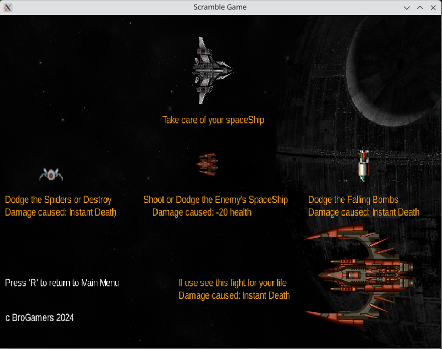
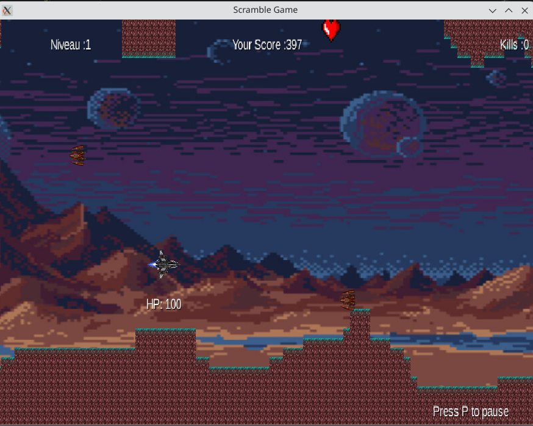
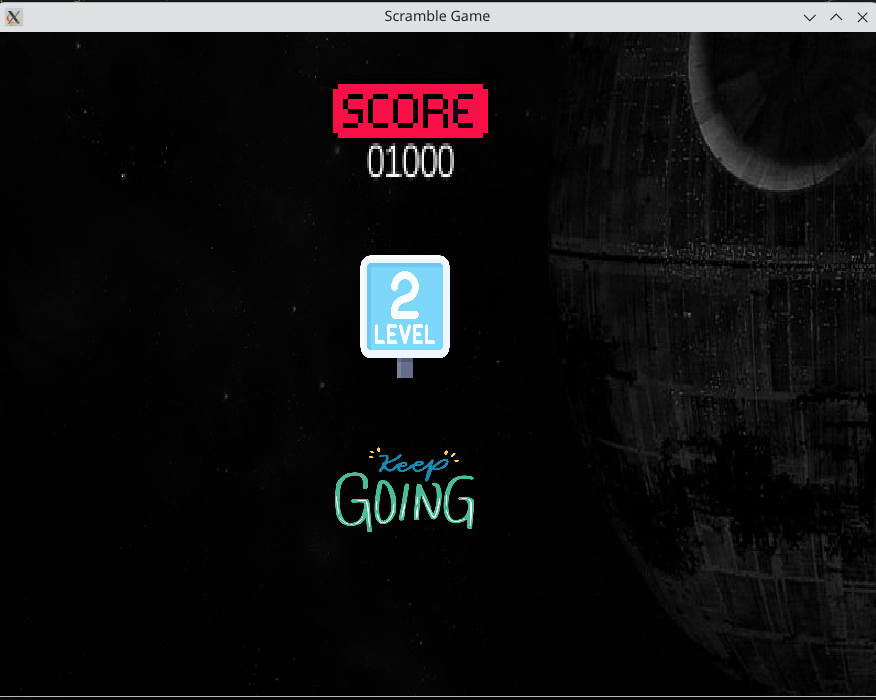
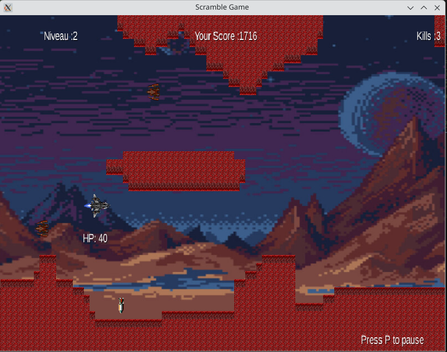
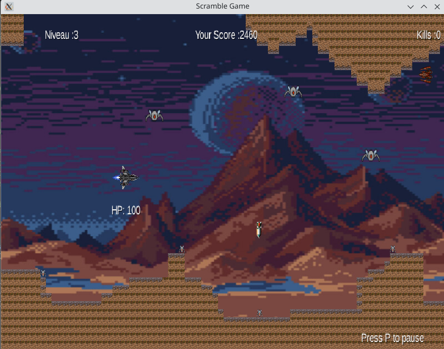
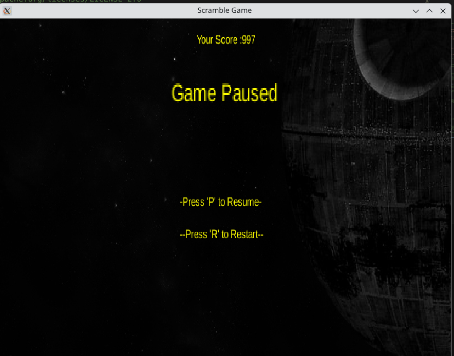
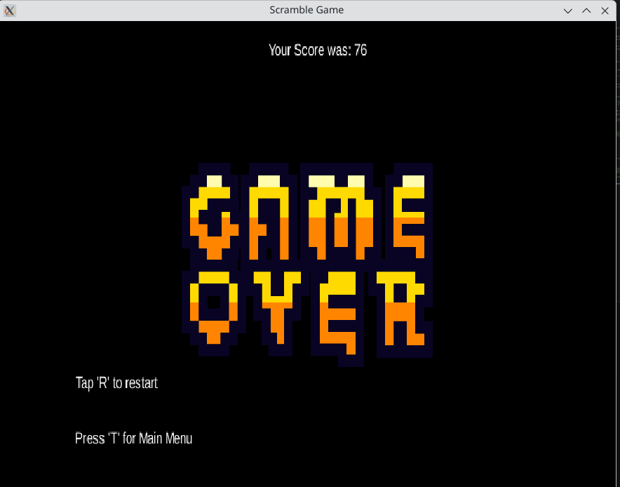

## 👾 Scrumble Game

**Scrumble Game** est un projet académique de **développement de jeu vidéo** réalisé en **Java** avec le framework **LibGDX**. Il a été conçu dans le cadre de la Licence 2 Informatique (2023-2024) à l’Université du Littoral Côte d’Opale – Calais, France.

Ce projet met en lumière mes compétences en **développement de jeux**, **architecture logicielle modulaire** (via Gradle) et **gestion optimisée des ressources multimédia** (sons, images, polices).

---

## ✨ Fonctionnalités et Description Détaillée

Scrumble Game est un **jeu interactif sur plateforme desktop** proposant une expérience utilisateur riche à travers plusieurs interfaces graphiques et niveaux.

* **Expérience utilisateur complète :**
    * **Menu principal** et **écrans informatifs** (Instructions, Infos Ennemis).
    * Interfaces dédiées à l'expérience de jeu (Pause, Game Over).
* **Système de jeu dynamique :**
    * Gestion de **4 niveaux distincts** avec complexité croissante.
    * Implémentation d'un système de **score**.
    * Mécaniques de **collision** et **animations** fluides.
* **Gestion Multimédia :**
    * Intégration de **sons** et **musiques** d'ambiance.
* **Contrôles :**
    * Activation des différentes interfaces et actions de jeu via les **entrées clavier**.

---

## 🚀 Objectifs du Projet

L’objectif principal de ce projet était de maîtriser l'ensemble du cycle de développement d'un jeu, de la conception à l'implémentation :

* Développer un **jeu fonctionnel complet** avec une architecture multi-interfaces.
* Apprendre l'**organisation d'un projet modulaire** en exploitant **Gradle**.
* Acquérir de l'expérience dans la **gestion des ressources** (images, sons, polices) dans un environnement de jeu.
* Créer une **expérience utilisateur interactive** soutenue par une progression sur plusieurs niveaux.

---

## 🛠️ Stack Technique

| Technologie | Version | Rôle / Utilisation |
| :--- | :--- | :--- |
| **Java** | 17 (OpenJDK / Temurin) | Langage de programmation principal. |
| **LibGDX** | Dernière stable | Framework de développement de jeu (graphismes, sons, input). |
| **Gradle** | Wrapper inclus | Outil de build et de gestion des dépendances, assurant l'architecture modulaire. |
| **LWJGL3** | - | Lanceur Desktop standard de LibGDX. |

---

## ▶️ Instructions de Compilation et Lancement

Le projet inclut le **Gradle Wrapper** pour faciliter la compilation et l'exécution sans installation manuelle de Gradle.

1.  **Compiler le projet :**
    ```bash
    ./gradlew build
    ```
2.  **Lancer le jeu (version Desktop) :**
    ```bash
    ./gradlew desktop:run
    ```

> Le jeu démarre sur le Menu Principal. Les options ouvrent ensuite les différentes interfaces graphiques.

---

## 🖼️ Aperçus (Screenshots)

| Écran | Description |
| :--- | :--- |
|  | Menu Principal |
|  | Écran des Instructions |
|  | Informations sur les Ennemis |
|  | Phase de Jeu (Niveau 1) |
|  | Écran de Transition (Niveau 2) |
|  | Phase de Jeu (Niveau 2) |
|  | Phase de Jeu (Niveau 3) |
|  | Interface de Pause |
|  | Écran de Fin de Partie (Game Over) |